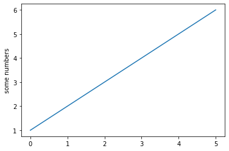

1. Cmd into cammcl.com folder

```hugo new --kind post posts/category/name-of-post```

This creates a leaf folder structure and index.md template that i have set up in archetypes.

2. cd into the folder, start up a jupyter session

``` cd content/posts/category/name-of-post```

3. start up a jupyter lab session. 

``` jupyter lab``` 

4. create a new notebook, save name as index.ipynb

5. open index.md and copy params/arcehtyep shit to notebook first markdown cell. edit the content.

6. write the rest of your notebook. save

7. convert the notebook to ipynb.

```jupyter nbconvert index.ipynb --to markdown --NbConvertApp.output_files_dir=.```


```python
import matplotlib.pyplot as plt
plt.plot([1, 2, 3, 4, 5, 6])
plt.ylabel('some numbers')
plt.show()
```





So far in this series of posts I have been building a Hugo based [website](https://www.lindaleitch.com) to display my mother in law's amazing ceramics and art. I have set her website up so she can create content/posts using a CMS such as Netlify from her ipad. 

However on [my website](https://www.cammcl.com) I also create contents/posts from a Jupyter Notebook and I thought it would be useful to share what I have learned here to help anyone else doing the same.

I have two main sections ([Posts](/posts) and [Notes](/notes)) where I display Juptyer notebooks:
 - **Posts** are notebooks where I look into topics in more detail, such as tutorials or research. These posts might have apps, elements, feature posts which require them to be created in a certain way. !Check feature posts!

 - **Notes** are more concise cheat sheets on various topics that I use for quick reference. If I search for a solution on stackoverflow, I generally create a cheet sheet to save it for the future. They are open source and available to edit on github. I use these at cookiecutters. If i'm doing something at work / home and i can't remember exactly how i've done it before, i know where i can find the answer quickly without having to sort through a dozen incorrect/old stackoverflow answers.

For both sections I use jupyer notebooks to create the content. Why? Jupyter lab allows me to type markdown and code, share visualisations, etc etc. 

Also i've set up a online hub lab session which I can log into from any computer that has internet access. I can create my content, save it and sync it with my gdrive and then launch a script to add it to my website.

The process to display the notebook is slightly different for each section.

## Posts

i follow this process using leaf/page bundles as it allows for featured images.

- cmd into cammcl.com folder

- hugo new --kind post posts/category/name-of-post

note i have set up the archetype here for what i want

- open the index.md, edit cat, tags, project, etc
- add a featured.jpg if needed

- jupyter lab to open a jupyter lab session and creeate a notebook. if i have a notebook already i copy it into the folder and then open jupyter lab and run it to make sure i'm happy. once happy save.

convert to markdown

```jupyter nbconvert sample_notebook.ipynb --to markdown --NbConvertApp.output_files_dir=.```

append to the end of the index file

``` type sample_notebook.md >> index.md ```

build hugo server -D to preview.


another way is to convert to html and then add as a scrolling page.

-nbconvert --to html <NOTEBOOK_NAME>.ipynb

```
<iframe
       src="./<CONVERTED_NOTEBOOK_FILENAME>"
       width="90%"
       height="1000px"
       style="border:none;">
 </iframe>
```

- cd into contents/posts/cat

- jupyter lab xyz


- cmd new post (need to set up metadata archetypes here?)
- run script to add to index? or just name it as index?

## Notes 

i follow this process:
- copy paste the meta data as first cell
- run script to conver to md and move images/folder structure
- only make notes public for editing?

Show versions of pakcages

Need to confirm process

Need to get featured image working!!!!

Need to build posts page / index

Need to make sure projects page works for building a website series

need to make notes editable on github - not everything... submodule?
markdown cheat sheet

notes menu:
- by package?
- by topic?

X minute read?

Menus working

Theme

Content


Break down post so far into sections:
- installing
- hugo 101
- netlify deploy
- cms
- jupyter

Metadata
- title
- subtitel is 

## Test header with two "##"


with the markdown above do I need to enter dates? if you enter futures dates it doesn't work


```python
print("test python print")
```
  
    test python print
    


 (also do naming conventions, pip stuff, etc)

```python
3 + 2
```


    5


VS code spell check

last mod date?

how do I make my name and catoergy go down the bottom

how do I make output look different for above? e.g. in html the 3+2 and ther result 5 look like the same. check other examples

also how to I automate the markdown header? 
use the categories?
automatically build a table?

## List of categories:
- Python
- Trading
- Jupyter
- SQL
- Hugo
- Machine Learning
- Backtesting
- Psychology
- How To
- Git
- Volatility

## Tags:
- candlestick
- mplfinance
- yfinance

Sample posts:

- creating a hugo website (part 1 initial setup)
- creating a hugo website - content managemnt
- deploying
- cms
- staticman ocmments

- Some of my favourite coronavirus charts

- setting up ssh keys for git

- Setting up google drive for jupyterlab
- Jupyterlab hosting online
  
- Comparison of Candlestick charts options in pythons
  - basic plot and functionality (zoom, pan, etc)
  - moving average
  - custom theme tests:
    - bloomberg theme 
    - trade the tape theme

- Creating a resumebot

- https://alison.rbind.io/categories/hugo/ projects

https://www.tidyverse.org/blog/ contents

how to update? just convert?
